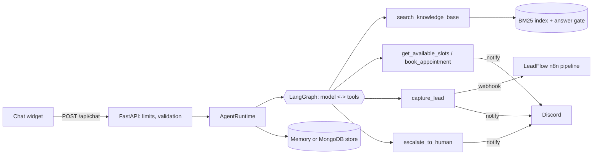

# Concierge Agent

A grounded customer-support agent for small businesses. It answers **only from the business's own documents** and cites them, **refuses** when the documents do not cover a question, **books appointments**, **captures leads**, and **hands off to a human** with a summary. Everything an action can do is validated by code, not by the model.

Built with Python, FastAPI, LangGraph, Groq (free tier), and an optional MongoDB store. It deploys on free tiers and works for any business by swapping a folder of documents.



**Deploying?** Follow [DEPLOY.md](DEPLOY.md): Render + Vercel + MongoDB Atlas, then run `scripts/smoke_test.py`. The portfolio website is in `site/`.

## What it demonstrates

| Capability | Where |
|---|---|
| Retrieval over uploaded docs (.md, .txt, .pdf) with citations | `app/rag/`, `app/agent.py::finalize_answer` |
| Refusal when the docs do not cover a question (coverage gate) | `app/rag/retriever.py` |
| Tool use with code-side validation, limits and dedupe | `app/tools.py` |
| Human handoff queue with transcript and summary | `escalate_to_human`, `/api/admin/handoffs` |
| Prompt-injection defense, abuse limits, safe output | `app/security.py`, `tests/test_tools.py`, `tests/test_agent.py` |
| Per-visitor memory, no cross-visitor leakage | `app/storage.py`, `tests/test_agent.py` |
| Offline retrieval eval, live eval, CI regression gate | `evals/run_eval.py`, `.github/workflows/ci.yml` |
| Multi-business via config only | `knowledge/<tenant>/` |

## Quickstart

```bash
python -m venv .venv && source .venv/bin/activate
pip install -r requirements-dev.txt
cp .env.example .env            # add GROQ_API_KEY
export $(grep -v '^#' .env | xargs)
uvicorn app.main:create_app --factory --reload
# second terminal: python -m http.server 5500 -d site   (edit site/config.js: api = http://localhost:8000)
# set ALLOWED_ORIGINS=http://localhost:5500 in .env
```

```bash
python -m unittest discover -s tests -t . -v        # no network, no API key
python -m evals.run_eval --tenant brightside-solar   # retrieval eval, offline
python -m evals.redteam                            # 46 attacks vs a worst-case model, offline (see docs/REDTEAM.md)
python -m evals.run_eval --tenant brightside-solar --mode e2e   # real model, uses your free Groq key
```

## How an answer is produced

1. The API validates the session id and message size, then applies per-IP and per-session rate limits.
2. The runtime cleans the text (invisible characters, length cap) and runs an injection tripwire.
3. It loads **that visitor's** recent history, builds the system prompt, and runs the graph: model, tools, model, until a final answer or the step cap.
4. `search_knowledge_base` retrieves passages. The **gate** compares how much of the question (weighted by rarity) the passages cover, and counts words the knowledge base has never seen against it. Below the threshold the tool returns `NO_RELEVANT_INFORMATION` and the model must say it does not know.
5. The answer is sanitized, citations are checked against what was retrieved this turn (invalid ones are removed), and only cited sources are returned.

## Security model

| Threat | Defense | Test |
|---|---|---|
| Customer text tells the model to ignore rules or reveal the prompt | Tripwire flags it, prompt warns the model, **record-creating tools are blocked for that turn**, flagged text is not replayed in later turns | `test_injection_cannot_create_records_and_is_not_replayed` |
| Model invents a lead or booking | Code validates email/phone/date/time, caps per conversation, dedupes, checks real slots | `tests/test_tools.py` |
| Double booking | Atomic slot insert (unique index on MongoDB) | `test_a_slot_can_only_be_booked_once` |
| Documents contain instructions | Tool output is labelled as data; same output sanitizing | prompt + `_search` |
| Quota burning, spam | Rate limits, 16 KB body cap, message length cap, lead/booking caps | `test_rate_limit_returns_429_with_retry_after` |
| Discord ping injection | Mentions neutralized and `allowed_mentions` disabled | `test_lead_saved_dedupes_and_forwards_to_webhook` |
| Error text leaks keys or stack traces | Generic 500, LLM errors become a fixed fallback | `test_errors_do_not_leak_internals`, `test_llm_failure_returns_a_safe_fallback` |
| Cross-site abuse | CORS only for `ALLOWED_ORIGINS`, no credentials | `test_cors_only_for_listed_origins...` |
| Staff endpoints exposed | Disabled unless `ADMIN_TOKEN` is set, constant-time compare | `test_admin_is_disabled_without_token...` |

## Evaluation

`evals/run_eval.py` reads `knowledge/<tenant>/eval.jsonl`. Question types: `answerable`, `unanswerable`, `unanswerable_in_domain`, `injection`, `action`.

- **Retrieval mode** runs offline and is a CI gate. Edit a document, break an answer, and the build fails.
- **E2E mode** runs the real model and scores citations, refusals, injection resistance and tool use.

Results on the bundled sample packs (retrieval mode, offline):

| Pack | Answerable recall | Off-topic refused |
|---|---|---|
| brightside-solar (26 / 10 questions) | 26 / 26 | 9 / 10 |
| chidama-tech (7 / 4 questions) | 7 / 7 | 4 / 4 |

Read these honestly. I wrote the questions and then tuned synonyms until they passed, so they are in-sample and only show the harness works. The one miss ("Do you offer pool cleaning services?") passes the lexical gate because "cleaning" and "services" appear in the documents. That is a real limit of lexical gating; the prompt tells the model to answer only from passages, and the e2e eval scores that case. `RETRIEVER=hybrid` adds embeddings. **For your own client, write 40 or more fresh questions, run both modes, and report those numbers.**

## Use it for another business

1. Copy `knowledge/brightside-solar/` to `knowledge/<your-slug>/`.
2. Replace the documents (`.md`, `.txt`, `.pdf`). Use `##` headings; each section becomes a retrievable unit.
3. Edit `tenant.json`: names, welcome message, rules, timezone, booking hours (or `"booking": {"enabled": false}`), synonyms.
4. Write `eval.jsonl`, run the retrieval eval, add synonyms for real misses, repeat.
5. Set `TENANT=<your-slug>`.

## Connect it to LeadFlow

Set `LEAD_WEBHOOK_URL` to your LeadFlow webhook and `LEAD_WEBHOOK_TOKEN` to its `X-Form-Token`. Leads captured in chat then enter the same validation, scoring and CRM routing as form leads, with `source: ai-chat`.

## Free deployment

- **Backend:** Render free web service from the `Dockerfile`, or any always-free VM. Free web services sleep after idle time, so the first message after a quiet period can take about 30 seconds. The widget says so.
- **Database:** `STORE=memory` is lost on restart. For durability use MongoDB Atlas free tier: `STORE=mongo`, `MONGO_URI=...`.
- **Widget:** host `widget/index.html` on GitHub Pages or Vercel and add its origin to `ALLOWED_ORIGINS`.
- Set `TRUST_PROXY=true` behind a proxy so rate limits see the real client IP. `X-Forwarded-For` is client-controlled at its left end, so the app reads it from the right: `TRUSTED_PROXY_HOPS=1` for Render alone, `2` if you add Cloudflare in front. Too low and everyone shares one address; too high and visitors can spoof theirs.
- Three more limits protect the free LLM quota: 20 messages per IP per minute, `RATE_LIMIT_IP_PER_DAY` (150) per IP per day so rotating session ids does not help, and `DAILY_TURN_CAP` (600) across all visitors, which answers 503 with `Retry-After` instead of burning the key. Keep it below your Groq daily limit.
- Free tiers change; check current limits before relying on them.

## Migrating from the earlier repository

Delete `agent.py`, `main.py`, `facts.json` and `leads.csv` from the repo root. The old facts live in `knowledge/chidama-tech/`, **which is a starter rebuilt from a summary: check every line against your original `facts.json` and add the rest.** Your React frontend keeps working if you update its request as in `docs/API.md`. If a `.env`, Mongo URI or Discord webhook was ever committed, rotate it.

## Known limits

- Lexical retrieval cannot see meaning without shared words. Use synonyms or `RETRIEVER=hybrid` (experimental; tune `VECTOR_MIN_SIM` with the eval).
- The rate limiter is in-process memory. For several instances use a shared limiter or a proxy.
- Injection tripwires are regexes; they reduce risk and keep humans in the loop, they do not make the model immune.
- Chats go to a third-party LLM API. Do not feed it data you are not allowed to share, and tell visitors (the widget shows `privacy_notice`).
- Booking records live in your store and a webhook. There is no calendar integration yet.

## Verification status

Run before delivery (Python 3.12, FastAPI, httpx and LangGraph installed): 85 tests pass, 5 skipped (the MongoDB contract tests need a live `MONGO_URI`). The offline knowledge evals pass for both packs and the offline red-team harness blocks 25 of 25 code-layer attacks with 0 false positives on 18 normal messages. **Not run:** the live Groq evals (`run_eval --mode e2e` and `redteam --mode e2e`) and the MongoDB tests, because no API key or database was available. Run them yourself, read every listed red-team failure by hand, and only then publish a number. The proxy-hop setting also needs one real check after deploy: send a request with a forged `X-Forwarded-For` and confirm it does not change which client the limiter sees.
